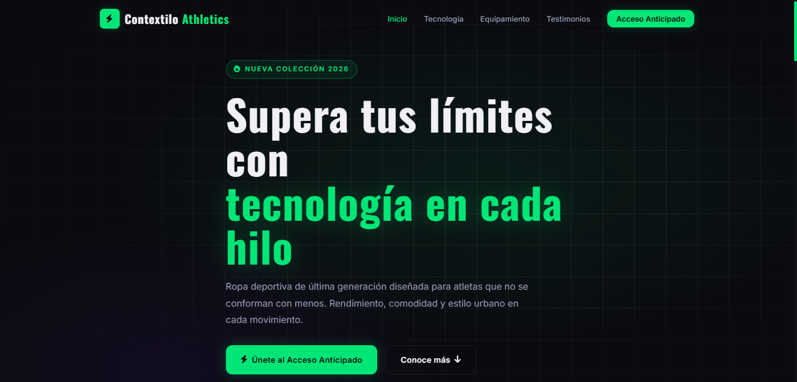
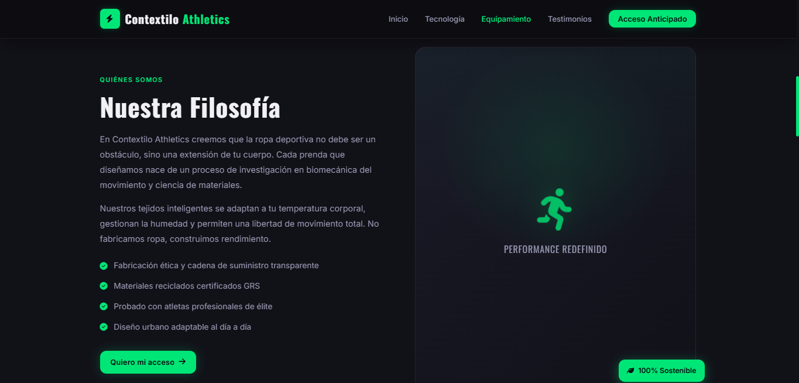
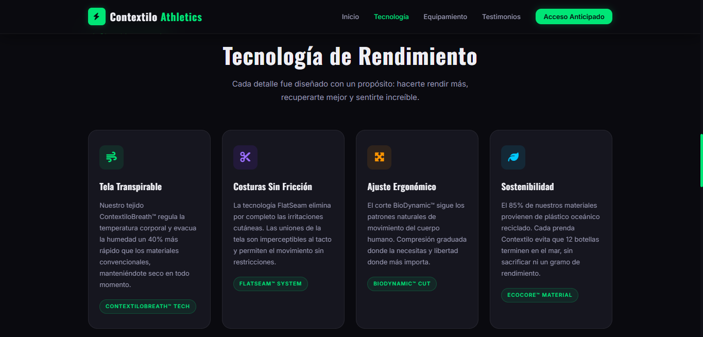
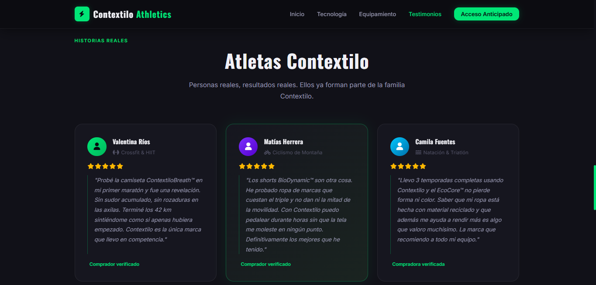
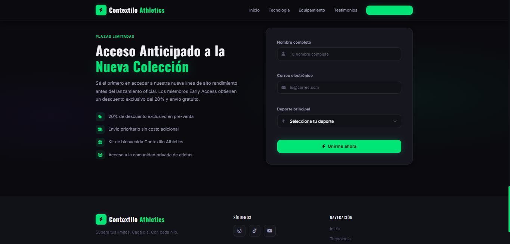
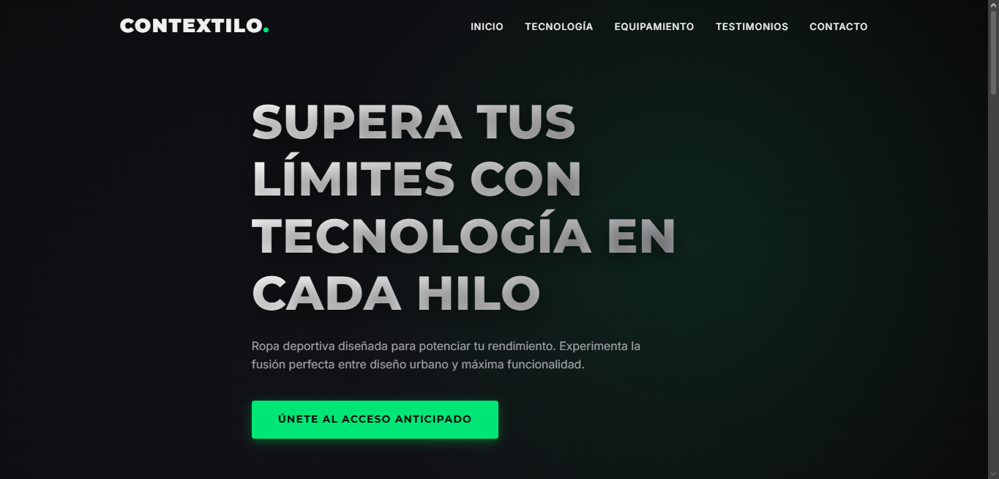
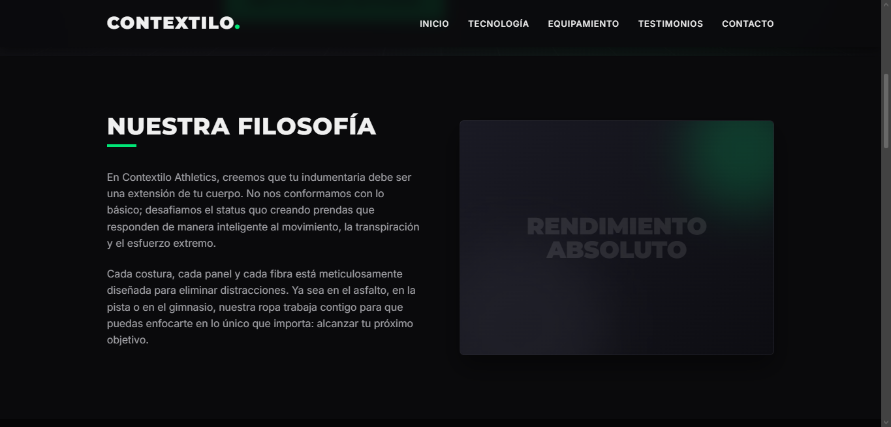
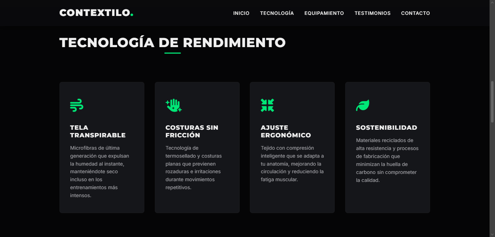
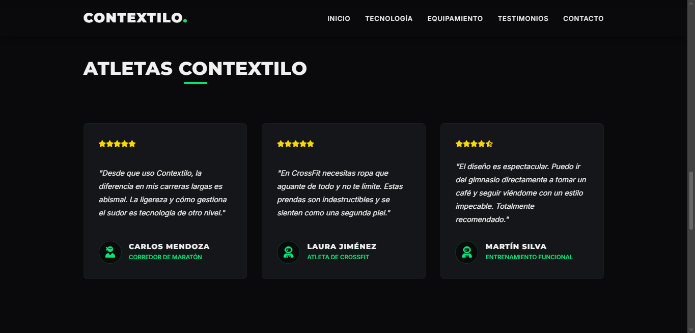
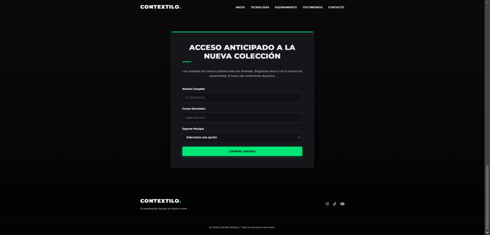

# Práctica Formativa Obligatoria 2 - Prompt Engineering en Agentes de IA

## Datos del estudiante
- **Estudiante:** Matias Contreras
- **Carrera:** Tecnicatura en Desarrollo de Software

## Link al deploy unificado
[Enlace a Vercel](https://pfo2-front-end.vercel.app/)

## Prompt exacto utilizado

```text
# IDENTIDAD Y ROL
Actúa como un Desarrollador Frontend Senior, Especialista en UX/UI y Experto en Marketing de Conversión. Tu tarea es trabajar de forma 100% autónoma para escribir el código completo y listo para producción de una Landing Page.
No debes pedir aclaraciones. Debes tomar todas las decisiones técnicas y de diseño priorizando un código limpio, accesible, responsive y de alto impacto visual.

# CONTEXTO DEL PROYECTO
La Landing Page es para "Aura Athletics", una marca de ropa deportiva de alto rendimiento y estilo de vida activo.
- **Público objetivo:** Atletas amateur, entusiastas del fitness y personas que buscan ropa deportiva que combine tecnología de rendimiento con diseño urbano moderno.
- **Tono de la marca:** Enérgico, motivador, premium y tecnológico. 
- **Objetivo principal:** Lograr que los usuarios se interesen en la nueva colección y utilicen el formulario para unirse a la lista de acceso anticipado (Early Access).

# RESTRICCIONES TÉCNICAS Y REGLAS ESTRICTAS
<rules>
1. Escribe EXCLUSIVAMENTE en HTML5 semántico, CSS3 puro y JavaScript Vanilla.
2. PROHIBIDO el uso de frameworks o librerías externas (nada de Bootstrap, Tailwind, React, jQuery, etc.). Solo puedes importar Google Fonts y FontAwesome (vía CDN).
3. PROHIBIDO usar texto de relleno como "Lorem Ipsum". Todo el texto (títulos, descripciones, testimonios) debe ser real, persuasivo y en español neutro.
4. PROHIBIDO omitir código. No uses comentarios como "<!-- el resto del código aquí -->". Debes generar el código fuente completo de principio a fin.
5. Genera exactamente tres archivos separados: index.html, styles.css y script.js.
</rules>

# ESTRUCTURA DE LA LANDING PAGE
Debes incluir las siguientes secciones obligatorias, en este orden exacto:

<sections>
1. HEADER (Cabecera)
- Navegación fija (sticky) con un fondo que se adapte al hacer scroll.
- Logo de "Aura Athletics" a la izquierda.
- Menú con enlaces a: Inicio, Tecnología, Equipamiento, Testimonios, Contacto.
- En dispositivos móviles, implementar un menú hamburguesa 100% funcional gestionado con JavaScript.

2. HERO SECTION (Sección Principal)
- Fondo oscuro con un gradiente dinámico o un patrón geométrico moderno hecho con CSS que transmita energía y movimiento.
- Título principal impactante (ej. "Supera tus límites con tecnología en cada hilo").
- Subtítulo motivacional.
- Botón principal de llamada a la acción (CTA): "Únete al Acceso Anticipado" (con scroll suave hacia el formulario).

3. SOBRE NOSOTROS / DESCRIPCIÓN
- Título: "Nuestra Filosofía".
- Un texto persuasivo sobre cómo Aura Athletics diseña prendas que se adaptan al cuerpo y al movimiento.
- Diseño en dos columnas en desktop (texto de un lado, un área de imagen simulada con CSS del otro).

4. CARACTERÍSTICAS PRINCIPALES
- Título: "Tecnología de Rendimiento".
- Crear 4 tarjetas (cards) utilizando CSS Grid o Flexbox, destacando beneficios: Tela transpirable, Costuras sin fricción, Ajuste ergonómico y Sostenibilidad.
- Cada tarjeta debe incluir un ícono, un título, una breve descripción y un efecto de elevación (box-shadow) al hacer hover.

5. TESTIMONIOS (Reseñas)
- Título: "Atletas Aura".
- 3 tarjetas de testimonios con opiniones ficticias pero realistas de deportistas.
- Incluir nombre, deporte que practican y una calificación visual de 5 estrellas.

6. FORMULARIO DE CONTACTO
- Título: "Acceso Anticipado a la Nueva Colección".
- Maquetación de un formulario con: Nombre, Correo Electrónico, Deporte Principal (select) y un botón de "Unirme ahora".
- Implementar validación del lado del cliente con JavaScript (campos vacíos y formato de correo). 
- Al hacer clic en enviar, si es válido, mostrar un mensaje de éxito manipulando el DOM (no realizar envíos reales al backend).

7. FOOTER (Pie de página)
- Logo y lema de la marca.
- Enlaces a redes sociales (Instagram, TikTok, YouTube).
- Copyright con el año actual generado dinámicamente con JavaScript.
</sections>

# DISEÑO Y ESTILO VISUAL (UI/UX)
- **Colores:** Paleta moderna y deportiva. Usa un fondo principal claro (o gris muy oscuro para modo nocturno), con acentos en colores energéticos (por ejemplo, un naranja neón #FF5722 o verde cian #00E676) para los botones y elementos clave.
- **Tipografía:** Importa desde Google Fonts una tipografía Sans-Serif geométrica e impactante para los títulos (ej. 'Oswald' o 'Montserrat') y una legible para el cuerpo (ej. 'Inter' o 'Roboto').
- **Interactividad:** Agrega transiciones CSS suaves a todos los elementos interactivos. Implementa scroll suave (smooth scrolling) para la navegación con enlaces ancla.
- **Responsividad:** Aplica un enfoque Mobile-First asegurando que el diseño se vea impecable en 320px, 768px y 1024px en adelante.

# FORMATO DE ENTREGA
Entrega el código de forma estructurada proporcionando los tres bloques de código completos:
1. Código para `index.html`
2. Código para `styles.css`
3. Código para `script.js`
Asegúrate de que los archivos estén correctamente vinculados entre sí.
```

## Capturas de pantalla de ambos sitios web generados

### Sitio web generado por el Agente 1






### Sitio web generado por el Agente 2





